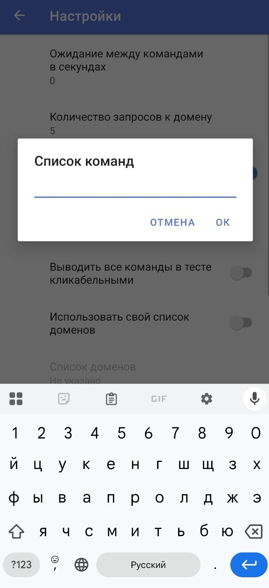
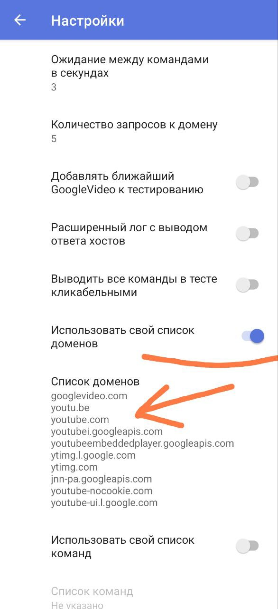

1. [Белый и чёрный списки](#whitelist-blacklist)
2. [Редактор командной строки](#editor)
3. [Выводить все команды в тесте кликабельными](#clickable)
4. [Свой список команд (стратегий)](#my-list)
5. [Экспорт и импорт настроек](#export-import)
6. [Способы запуска](#launch)
7. [Режимы VPN и Proxy](#vpn-proxy)
	- [Режим HTTP-proxy](#http-proxy)
8. [Точечная маршрутизация сайтов (доменов)](#split-tunneling)
9. [Раздача интернета с ByeByeDPI](#distribute)
10. [Автоматизация](#automation)
	- [Автозапуск ByeByeDPI при запуске YouTube](#youtube-autostart)
12. [Настройки для работы с AdGuard](#adguard)
13. [Разблокировать свои ресурсы](#my-services)
14. [Автообновление](#autoupdate)

## <a id="whitelist-blacklist">Белый и чёрный списки</a>

_Белый_ список - выбранные приложения **будут работать** через ByeByeDPI, все остальные будут работать в обход ByeByeDPI.
**Черный** список - выбранные приложения **НЕ будут работать** через ByeByeDPI, все остальные будут работать через ByeByeDPI.

> [!TIP]
> Почему списки **важны**? Некоторые приложения (например, Телеграм) могут не работать или работать некорректно.
> Плюсом ко всему, чем **меньше трафика** проходит через ByeByeDPI, тем **меньше** заряда батареи **тратится**.
> На некоторых телевизорах (приставках) без настройки белого списка может **совсем не работать интернет**.

## <a id="editor">Редактор командной строки</a>


В разделе **Редактор командной строки** находится список **Аргументов командной строки** (стратегий), которые применялись ранее.


> [!WARNING]
> Будьте внимательны: длина списка ограничена, если список переполнится - самые старые стратегии пропадут

Если **нажать** на стратегию - появится меню:


- Действие **Применить** - применит команду (сделает её текущим _Аргументом командной строки_)

  - 

- Действие **Закрепить** - закрепит стратегию сверху списка

  - 

- Действие **Переименовать** - позволяет дать имя стратегии или переименовать её

  - 

- Действие **Копировать** - скопирует стратегию в буфер обмена
- Действие **Удалить** - удалит стратегию из списка (истории)

## <a id="clickable">Выводить все команды в тесте кликабельными</a>

> [!TIP]
> Для чего может пригодиться данная настройка?
> Вы не хотите ждать окончания подбора, так как тест уже показал высокие (50 и более) проценты у нескольких стратегий.
> У вас вылетает подбор, но при этом некоторые стратегии в тесте показывают большие (50 и более) проценты.

Данный параметр находиться в настройках **Подбора команд (Beta)**

Перейдите в пункт **«Подбор команд (Beta)»**[^1]

- 

- Перейдите в **настройки Подбора** (шестерёнка справа сверху)

  - 

- Активируйте ползунок **Выводить все команды в тесте кликабельными**

  - 

Теперь даже если подбор будет прерван, список стратегий будет иметь такой вид:


При нажатии на стратегию, будет выводиться меню:


- Действие **Применить** - применит команду (сделает её текущим _Аргументом командной строки_)

  - 

- Действие **Копировать** - скопирует стратегию в буфер обмена

## <a id="my-list">Свой список команд (стратегий)</a>

> [!IMPORTANT]
> Использовать свой список стратегий нужно **только в случае**, если в результате автоподбора небольшой процент ответа от доменов. Если вы видите, что у стратегий одинаковый (невысокий) процент ответа - решение [тут](problems.md#у-команд-стратегий-одинаковый-невысокий-процент)

Результаты автоподбора вас не устроили.
Вы где-то нашли команды (стратегии), но проверять каждую вручную очень глупое и утомительное занятие.

В таком случае: перейдите в пункт **«Подбор команд (Beta)»**[^1]

- 

- Перейдите в **настройки Подбора** (шестерёнка справа сверху)

  - 

- Активируйте переключатель **Использовать свой список команд**

  - 

- Нажмите на пункт **Список команд**

  - 

- Откроется окно

  - 

- В данное окно необходимо ввести свой список команд (стратегий)

> [!IMPORTANT]
> Каждая новая стратегия должна быть на **новой строке**. Команды (стратегии) **нельзя** разделять какими-либо символами (запятые, точки и т.д.) - стратегии разделяются **новой строкой**

- После ввода стратегий, нажмите **OK**

  - 

- Вернитесь в пункт **Подбор команд (Beta)** и нажмите на кнопку «Начать подбор»

- 

- После этого начнётся проверка стратегий, которые вы вставили в список

  - 

- Дождитесь окончания подбора и действуйте дальше как при [стандартной настройке](start.md#настройка). Если подбор вылетает - решение [здесь](problems.md#вылетает-подбор).

## <a id="export-import">Экспорт и импорт настроек</a>

Чтобы экспортировать или импортировать настройки, зайдите в **_основные настройки ByeByeDPI_** (шестерёнка справа вверху):

  - 

- Нажмите на три точки в верхнем правом углу

  - 

> [!WARNING]
> Экспортировать настройки с версии 1.4.1 и старше и импортировать их на 1.4.2 и новее невозможно.

- Выберите экспорт/импорт в зависимости от того что вам нужно (сохранить настройки (экспорт) или добавить (импорт)). Все настройки экспортируются в файл в формате `json`. При импорте необходимо указать данный файл.

  - 

## <a id="launch">Способы запуска</a>

### Классический запуск

Есть классический способ запуска: при помощи нажатия кнопки **Подключить**

- 

> [!TIP]
> Кому-то это может показаться неудобным, поэтому есть другие варианты.

### Запуск через шторку

- Зайдите в свою шторку и найдите пункт **Изменить** (или что-то вроде)

  - 

- После этого вы увидите неактивные элементы. Найдите среди них ByeByeDPI, зажмите и перетащите его к основным элементам.

  - 

- Не забудьте сохранить изменения

  - 

- Теперь вы можете запускать ByeByeDPI нажатием кнопки в шторке

  - 

### Контекстное меню

Если зажать иконку ByeByeDPI появится контекстное меню через которое можно быстро включить и выключить приложение.


### Виджет

Приложение не реализует функционал виджета по умолчанию. Несмотря на это, создать виджет возможно:

- некоторые лаунчеры позволяют сделать виджет из пунктов быстрого меню

  - 

- если ваш лаунчер не имеет такого функционала, воспользуйтесь приложением `QuickShortcutMaker`.

## <a id="vpn-proxy">Режимы VPN и Proxy</a>

> [!CAUTION]
> Использовать режим **Proxy** можно только в том случае, если вы подключаетесь при помощи прокси-клиента.

> [!WARNING]
> Известен только один клиент YouTube с встроенным прокси-клиентом: SmartTube. Если он не работает у вас в связке с ByeByeDPI (например, из-за Android 9) и вы по какой-то причине не можете или не хотите использовать ByeByeDPI в режиме VPN - смотрите YouTube через Firefox с настроенным расширением ZeroOmega (подробнее про это [здесь](#extension)).

> [!TIP]
> Для чего использовать режим прокси? Данный режим полезен, если вы хотите параллельно использовать приложения, работающие в режиме VPN (например, AdGuard и др.) или если вы целенаправленно хотите использовать какой-либо прокси-клиент (например, расширение ZeroOmega для точечного проксирования сайтов в браузере)

Режим VPN **насильно** пропускает трафик через ByeDPI. Режим Proxy просто поднимает локальный **SOCKS-прокси**.

Локальный прокси поднимается и в режиме VPN: можно подключаться к прокси при помощи какого-либо прокси-клиента при использовании ByeByeDPI в режиме _белого_ списка.

Прокси поднимается в любом режиме, но в режиме VPN клиентом данного прокси является ByeByeDPI
Схематическое изображение работы VPN-режима (HevSocks5Tunnel и ByeByeDPI направляют трафик в интернет):


В режиме Proxy пользователю нужно самому подключить прокси-клиент к прокси для выхода в интернет:


### <a id="http-proxy">Режим HTTP-proxy</a>

В данном режиме будет проксироваться HTTPS или любой TCP трафик, кроме HTTP.

По умолчанию ByeByeDPI запускает локальный SOCKS-прокси, но некоторые прокси-клиенты не способны работать с таким протоколом. В таком случае можно активировать **режим HTTP-прокси**.
Чтобы сделать это, необходимо активировать переключатель HTTP-прокси:


> [!NOTE]
> Другой вариант активации данного режима - приписать к стратегии аргументы: `-G` или `--http-connect` (данные аргументы идентичны по смыслу).
>
> Пример такой стратегии:
> `--http-connect -d1 -s0+s -d3+s -s6+s -d9+s -s12+s -d15+s -s20+s -d25+s -s30+s -d35+s -At,r,s -s1 -o1+s -s-1`

## <a id="split-tunneling">Точечная маршрутизация сайтов (доменов)</a>

> [!TIP]
> Для чего нужная точечная маршрутизация? Обход DPI может ломать сайты, которые работают без всяких обходов. Например, `kremlin.ru`

### Нативный способ

Чтобы ByeByeDPI обрабатывал только определённые домены, можно добавить в стратегию аргумент `--hosts` (`-H`) и вписать нужные домены:

```
# из документации к ByeDPI

-H, --hosts <file|:string>
    Ограничить область действия параметров списком доменов
    Домены должны быть разделены новой строкой или пробелом

```

### "Белый список" для доменов

Если указать хостлист до завершения группы (_-A_), то стратегия для этой группы будет взаимодействовать только с доменами из списка.

Примером такой стратегии будет:

```
-H:"googlevideo.com youtubei.googleapis.com i.ytimg.com yt3.ggpht.com youtube.com" -o1+s -d3+s -a2
```

> [!NOTE]
> Скобки необходимы из-за особенностей механизма парсинга

> [!TIP]
> Использовать белый список в таком режиме не обязательно

### "Чёрный список" для доменов

В некоторых случаях требуется ограничить работу ByeByeDPI на каких-то конкретных доменах: например, для `kremlin.ru` и `ya.ru`. Чтобы ByeByeDPI не обрабатывал трафик, с этих доменов необходимо в начале стратегии добавить список доменов в отдельную группу: `-H:kremlin.ru ya.ru -An`. Если говорить простыми словами, данная часть означает: если домен `kremlin.ru` или `ya.ru` - ничего не делай. **Важно** не забыть _-A_ с нужным параметром после списка.

Пример такой стратегии будет выглядеть следующим образом:

```
-H:"kremlin.ru ya.ru" -An -o1+s -d3+s -a2
```

---

> [!TIP]
> Если на вашем устройстве получен **root** (или вы получили доступ к системным директориям при помощи [Shizuku](https://github.com/RikkaApps/Shizuku) или другим способом) - можно указать путь, по которому находится текстовый файл с доменами.
> На Андроиде приложению доступ будет не в любую папку.
> Текстовый файл должен находится по пути: `/storage/emulated/0/Android/data/io.github.romanvht.byedpi/files/...`
> Таким же образом можно указать содержимое фейковых пакетов.

Пример такой стратегии:
`-Ku -a10 -An -Kt,h -H /storage/emulated/0/Android/data/io.github.romanvht.byedpi/files/domain.txt -s1 -q1 -Art -f-1 --md5sig -r1+s -An`

### <a id="extension">Расширение для браузера</a>

Другим вариантом может точечной маршрутизации будет использование прокси-расширения для браузера. В примере будет рассматриваться браузер `Firefox` с установленным расширением `ZeroOmega--Proxy SwitchyOmega V3`, но вы можете выбрать любое другое подобное расширение и любой другой браузер с поддержкой расширений.

- Первым делом активируем в ByeByeDPI режим прокси или **убираем из белого списка браузер**, в который будем устанавливать расширение
- Устанавливаем расширение и не забываем дать разрешение на работу в приватных окнах (это необходимо для работы прокси). Нажимаем кнопку **Добавить**

  - 

- После этого откроем список расширений и нажмём на `ZeroOmega`

  - 

- Перейдём во вкладку настроек

  - 

- Во вкладке _Proxy_ настроим подключение: протокол (по умолчанию у ByeByeDPI SOCKS5), адрес и порт прокси (адрес и порт указаны в настройках ByeByeDPI). В моём случае:

```
Protocol: SOCKS5
Server: 127.0.0.1
Port: 1080
```

- После настройки подключения не забываем применить изменения: нажать `Applay changes`

  - 

- Перейдём во вкладку `auto switch`. И добавим _Switch rules_. Например, я добавил:

```
Condition Type: Host Wildcard
Condition Details: *.youtube.com
Profile: proxy
```

- Не забываем сохранить изменения: нажимаем `Applay changes`

  - 

- После этого пробуем зайти на нужный ресурс. Он **может не открыться** сразу. Необходимо изменить режим `ZeroOmega` на режим `auto switch`.

  - 

  - 

- После этого нужно обновить страницу с вашим ресурсом. Или перейти по нужной ссылке: например, я открыл видео для просмотра. Но оно не начало воспроизводиться. Значит необходимо перейти в настройки расширения:

  - 

- В режиме `auto switch` расширение сообщит, если какие-то домены не могут нормально работать:

  - 

- Открываем вкладку _failed resources_, меняем их профиль на proxy и добавляем:

  - 

- Обновляем страницу: теперь всё работает

  - 

- В настройках это теперь выглядит как-то так:

  - 

> [!IMPORTANT]
> При отключенном ByeByeDPI домены, которые указаны для проксирования, не будут работать совсем. При отключении ByeByeDPI рекомендуется сменить режим `ZeroOmega` на _Direct_

## <a id="distribute">Раздача интернета с ByeByeDPI (локальный прокси)</a>

Допустим у вас есть **iPhone** *(или другое устройство, на которое можно установить прокси-клиент)* и телефон с Android 6.0+ *(или другое устройство, на котором работает ByeByeDPI)*.
На телефон установлен ByeByeDPI, подобрана рабочая стратегия. На **iPhone** *(или другом устройстве)* ставится прокси-клиент с поддержкой **SOCKS5** (например `Happ` подойдёт для iOS и Android).

Чтобы раздать доступ к ByeByeDPI, нужно сделать так, чтобы оба устройства *(можно подключать не одно устройство, но в примере одно)* были в одной локальной сети. Можно их подключить к одной точке доступа, можно раздать точку доступа прямо с телефона, в целом это не имеет значения - главное, чтобы устройства находились в одной локальной сети.

Далее в настройках ByeByeDPI необходимо выставить адрес и порт на `0.0.0.0` и `1080` (порт можно любой незанятый) соответсвенно.

> [!CAUTION]
> Если вы хотите, чтобы на устройстве, с работающим ByeByeDPI, продолжал работать YouTube (и не только), то не активируйте режим Proxy. Иначе вам придётся ставить прокси-клиент и на устройство с ByeByeDPI. Чтобы понимать почему так происходит, и почему вы сможете подключаться с другого устройства даже при работе ByeByeDPI в режиме VPN - читайте [здесь](#vpn-proxy).


Запускаем ByeByeDPI.

После этого необходимо определить ip устройства в локальной сети, на котором запущен ByeByeDPI. Для этого используйте приложение [Android Network Tools](https://github.com/stealthcopter/AndroidNetworkTools). При заходе в это приложение будет написан ip-адресс:


ip устройства также можно узнать в настройках сети или при помощи приложения [Ning](https://github.com/csicar/Ning) .

> [!TIP]
> Для знающих: поставьте статический ip для телефона, если вы будете часто подключаться через него.

После этого открываем прокси-клиент на **iPhone** *(или другом устройстве)*. В примере используется `Happ`.

> [!WARNING]
> На iPhone нет туннелирования отдельных приложений. Вам придется добавлять собственные маршруты. В некоторых регионах, например в России, возможность подключения к SOCKS-прокси может быть удалена из Happ (в этом случае используйте другой клиент)

Добавляем подключение:


> [!IMPORTANT]
> Протокол SOCKS5 или SOCKS


Вводим ip устройства, на котором работает ByeByeDPI (ip выясняли при помощи *Android Network Tools*) и порт, который указан в ByeByeDPI. После ввода не забываем сохранить изменения.

> [!IMPORTANT]
> У прокси-сервера, который поднимает ByeByeDPI нет ни логина, ни пароля - в прокси-клиентах оставляем поля пустыми.


Если у прокси-клиента есть возможность проверки соединения, сделайте это


> [!NOTE]
> Если ответа нет, значит нет соединения: выключен ByeByeDPI, указаны неверные данные или устройства находятся в разных сетях.

После этого укажем приложения, с которыми должен работать ByeByeDPI на **iPhone** *(или другом устройстве)*:


После этого можно запускать приложение и смотреть YouTube


Прокси-клиенты на различные устройства и систем:

- на iPhone - `Happ`, `FoXray`, `Shadowrocket`, `Sockswitch-Shadowsocks Client`, `Potatso Lite`
- на Windows - можно использовать браузерные расширения, например, `ZeroOmega--Proxy SwitchyOmega V3` (алгоритм настройки [здесь](#extension) - единственное отличие: нужно вписывать не `127.0.0.1`, а ip устройства с запущенным ByeByeDPI) или использовать приложения: [nekoray](https://github.com/MatsuriDayo/nekoray/), proxifier, [proxifyre](https://github.com/wiresock/proxifyre), Happ, [sockscap64](https://www.sockscap64.com/homepage/) (для старых Windows).
- на MacBook - FoXray, [V2RayXS](https://github.com/tzmax/V2RayXS) (для старых маков), [nekoray](https://github.com/Mahdi-zarei/nekoray).
- на другое Android-устройство - `Happ`, [nekobox](https://github.com/MatsuriDayo/NekoBoxForAndroid), proxifier for Android, [SocksDroid](https://github.com/bndeff/socksdroid) (требуется Android 5.0+), [SocksTun](https://github.com/heiher/sockstun), для старых версий Андроид ProxyDroid (требуется рут).

## <a id="automation">Автоматизация</a>

По умолчанию `ToggleActivity` поддерживает подключение/отключение ByeByeDPI.

Если [закрепить](#editor) стратегии и дать закреплённым стратегиям [названия](#editor), то `ToggleActivity` будет поддерживать следующие параметры:

| Параметр      | Действие                                  | Тип    |
| ------------- | ----------------------------------------- | ------ |
| `strategy`    | Сменить стратегию и подключится           | String |
| `only_update` | Только обновить стратегию без подключения | Bool   |
| `only_start`  | Запустить сервис без смены стратегии      | Bool   |
| `only_stop`   | Остановить сервис без смены стратегии     | Bool   |

> [!TIP]
> Это может быть полезно для автоматической смены стратегии при подключении к другой сети: например, переключение с Wi-Fi на мобильный интернет или переключение от одного сотового оператора к другому. Сценарии реализуются при помощи специальных приложений, например, при помощи `MacroDroid`.

### <a id="youtube-autostart">Автозапуск ByeByeDPI при запуске YouTube</a>

Встроенной функции запуска ByeByeDPI при запуске каких-либо приложений нет и не планируется, однако данный функционал возможно реализовать при помощи приложения `MacroDroid`.

> [!WARNING]
> Необходимо снять ограничение на открытие приложений при работе фоном.

Активити запуска/остановки в ByeByeDPI - ToggleActivity.
Выглядеть должно примерно так:


Можно также сделать условие: если VPN включен и YouTube закрыт, тоже вызываем ToggleActivity


## <a id="adguard">Настройки для работы с AdGuard</a>

Переключаем ByeByeDPI в режим Proxy.


Добавьте ByeByeDPI в исключения AdGuard на вкладке "Управление приложениями":
в самом AdGuard переходим в центральную вкладку, а после ищем ByeByeDPI, и просто обрубаем его фильтрацию.


После переходим в настройки -> фильтрация -> сеть -> прокси. Его врубаем, а после вводим те же значения прокси, которые указаны у вас в ByeByeDPI, обязательно в режиме SOCKS5.


Ну и соответственно включаем работу прокси в AdGuard.

> [!WARNING]
> Если при проверке Adguard скажет "Не удалось подключиться к прокси", ничего страшного - прокси на самом деле работает!

> [!IMPORTANT]
> Может понадобиться добавить ByeByeDPI в исключения AdGuard другим способом:
> Заходим в AdGuard -> настройки -> основные-> расширенные->низкоуровневые настройки-> исключенные приложения
> Добавить в список id приложения ByeByeDPI
> `io.github.romanvht.byedpi`


## <a id="my-services">Разблокировать свои ресурсы</a>

Перейдите в **настройки подбора**. Отключите переключатель «Добавлять ближайший GoogleVideo к тестированию».
Активируйте переключатель «Использовать свой список доменов». Вставьте свой список доменов для проверки.



После этого ищите стратегию [аналогичным образом,](start.md#setting) которым искали стратегию для YouTube.

> [!WARNING]
> Если у всех стратегий 0% - скорее всего ресурс заблокирован по IP и ByeByeDPI здесь ничем не сможет помочь.

> [!TIP]
> Помните, крупные сайты и ресурсы для своей корректной работы могут требовать достаточно большое количество доменов.

Вот, например, домены для работы YouTube:

```
googlevideo.com
youtu.be
youtube.com
youtubei.googleapis.com
youtubeembeddedplayer.googleapis.com
ytimg.l.google.com
ytimg.com
jnn-pa.googleapis.com
youtube-nocookie.com
youtube-ui.l.google.com
yt-video-upload.l.google.com
wide-youtube.l.google.com
youtubekids.com
ggpht.com
```

Как видно, для работы YouTube нужен не один домен `youtube.com`.

Домены для различных сервисов можно найти [здесь](https://www.netify.ai/resources/applications), в этом [репозитории](https://github.com/v2fly/domain-list-community) или на этом [сайте](https://iplist.opencck.org/).

Если вы хотите сами выяснить какие домены используются: в этой [статье](https://itdog.info/analiziruem-trafik-i-opredelyaem-domeny-kotorye-ispolzuyut-sajty-i-prilozheniya/) подробно рассказывается про сниффинг трафика на различных устройствах и системах.

## <a id="autoupdate">Автообновление</a>

Приложение не реализует функционал автообновлений. Чтобы ByeByeDPI обновлялся автоматически, необходимо использовать [Obtainium](https://github.com/ImranR98/Obtainium).

- Установите Obtainium
- Нажмите на пункт "Добавить приложение"
	- 
- Добавьте репозиторий ByeByeDPI: `https://github.com/romanvht/ByeDPIAndroid/releases`
	- 
- Приложение добавлено
	- 
- Чтобы изменить параметры автообновления, необходимо изменить настройки Obtainium.

---

[^1]: Подбор команд находится в разработке. Могут быть ошибки. **Стратегии не генерируются автоматический** - они всегда одни и те же. В текущей реализации подбор по сути ничего не подбирает - он просто проверяет работу набора стратегий, которые были добавлены в него разработчиком.
