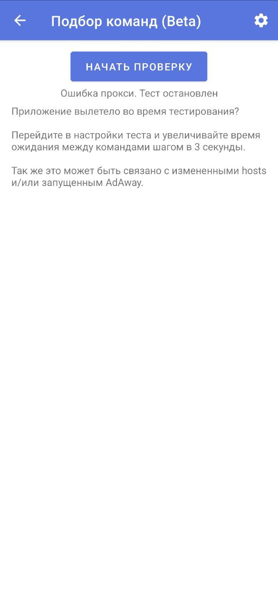
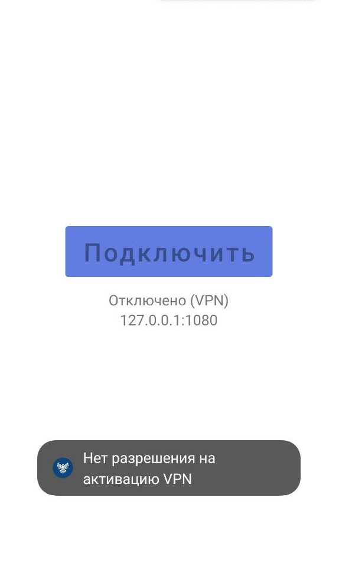
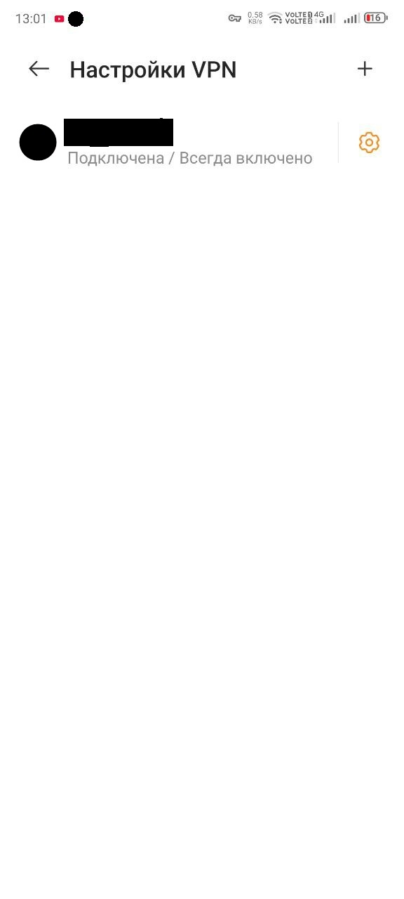
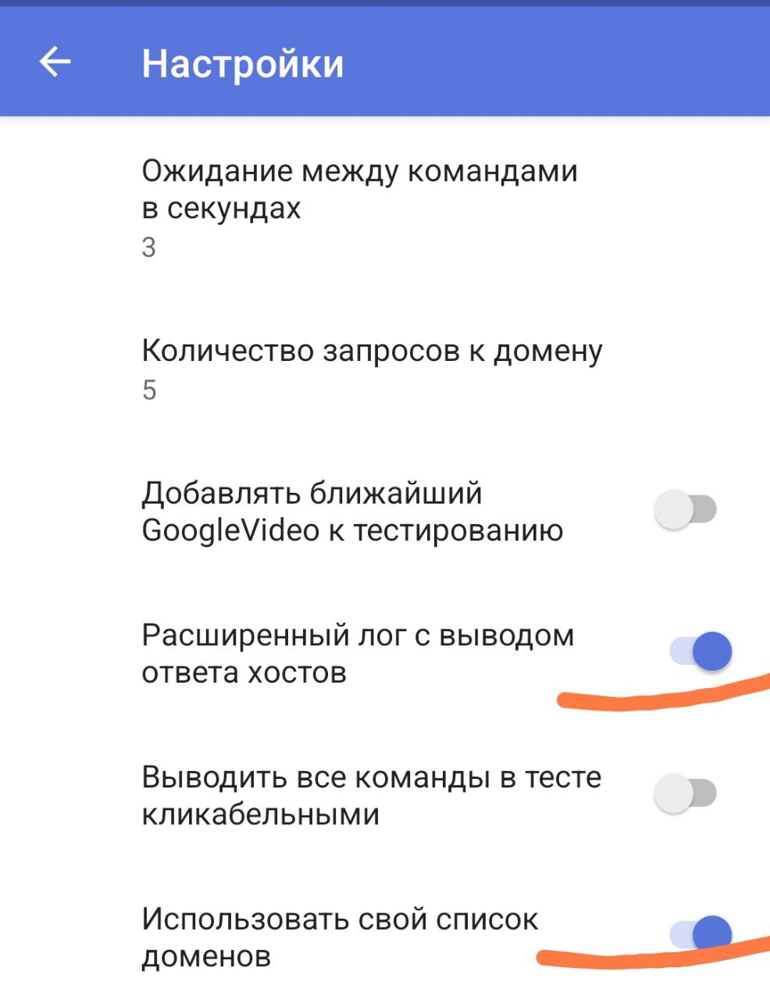
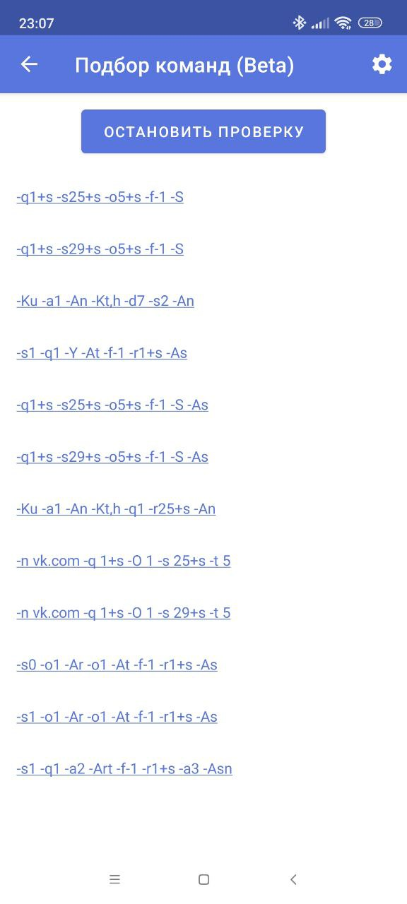
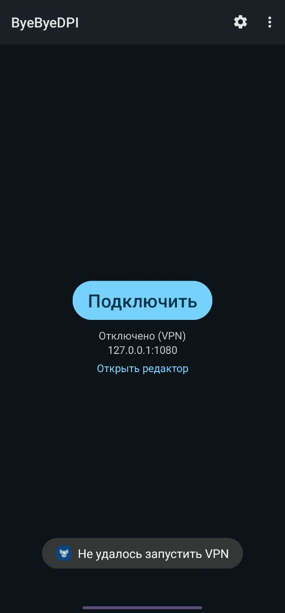

# Проблемы и решения

1. [Вылетает подбор](#crash-proxy-test)
2. [В ходе проверки у всех стратегий 0%](#only-0)
3. [У команд (стратегий) одинаковый невысокий процент](#equally-low-percentage)
4. [Нет разрешения на активацию VPN](#permission)
5. [Работает только на Wi-Fi или только на мобильном интернете, или только на одном провайдере](#only-one-case)
6. [Не работает какое-либо приложение или сайт при запущенном ByeByeDPI](#something-is-not-working)
7. [Не работает со SmartTube](#smarttube)
8. [Недавно всё работало, а сейчас не работает](#not-working-now)
9. [На телевизоре (приставке) пропадает интернет при запуске ByeByeDPI](#internet-is-lost)
10. [Нет звука в Discord](#ds-no-voice)
11. [Высокий процент, но совсем не работает](#high-not-work)
12. [На моём устройстве нельзя использовать режим VPN](#no-vpn)
13. [Очень низкие проценты (выше нуля)](#low-interest-rates)
14. [Не получается обновить или импортировать настройки](#digital-signatur)
15. [Самопроизвольное отключение ByeByeDPI](#abnormal-shutdown)
16. [Тратится безлимитный трафик на YouTube](#spend-traffic)
17. [Проценты не отображаются - их нет](#invisible-percentage)
18. [Не работает при одновременно включенных Wi-Fi и мобильном интернете](#simultaneously-wi-fi-mobile-web)
19. [Ошибка при синтаксическом анализе пакета](#error-parsing-the-package)
20. [Нет плиток YouTube на главном экране телевизора](#no-tiles-on-tv)
21. [В ByeByeDPI не работает DoT / DoH / DNS в формате IPv6](#only-dns-ipv4)
22. [Не работает на телевизоре Яндекс под управлением YaOS](#yaos)
23. [Совершенно не работает на ТВ / Нельзя установить приложение из-за WebOS/Tizen](#not-working-tv)
24. [Не удалось запустить VPN](#permission)

## <a id="crash-proxy-test">1. Вылетает подбор</a>



Если во время проверки произошел сбой - обновите приложение до версии >1.5.2.

## <a id="only-0">2. В ходе проверки у всех стратегий 0 ответов от доменов</a>

Поставьте другой DNS over TLS.

Остановите приложение, очистите его данные и перезагрузите устройство.
Можно попробовать сменить порт, например, на 1082.
Если ничего не помогло - попробуйте очистить все данные ByeByeDPI, удалить приложение и поставить его заново.
Увеличивайте таймауты в настройках подбора стратегий.

## <a id="equally-low-percentage">3. У стратегий одинаковый невысокий процент</a>

Обновите ByeByeDPI до последней версии. Если проблема не решена - поставьте другой DNS over TLS.

Если версия андроид 9 и ниже - это нормально: проведите тестирование на более свежем андроиде в этой же сети и перенесите стратегию на устройство со старым андроидом.

Если андроид 10 и более новый - есть вероятность, что блокировка по ip и ByeByeDPI не поможет.

## <a id="permission">4. Нет разрешения на активацию VPN</a>

Проблема в том, что ByeDPI выдал ошибку.

Если при попытке подключения вы видите надпись **Нет разрешения на активацию VPN**.



Перейдите в настройки устройства -> "Подключения" -> "VPN"


Если у вас такая картина: какое-то приложение постоянно работает в режиме VPN - отключите это приложение, чтобы подключения к VPN не было.
Ни в коем случае нельзя, чтобы какое-то приложение подписывалось *всегда включено*.



## <a id="only-one-case">5. Работает только на Wi-Fi или только на мобильном интернете, или только на одном провайдере</a>

Для каждой сети нужна своя стратегия. При подключении к другой сети необходимо найти нужные аргументы командной строки, то есть провести [повторный подбор](start.md#настройка). Когда рабочая стратегия для новой сети будет найдена - вы можете [закрепить её и подписать](#features.md#редактор-командной-строки) для какой сети данная стратегия.

Попробуйте также отключить [ускорение сети](#simultaneously-wi-fi-mobile-web) в настройках Wi-fi.

## <a id="something-is-not-working">6. Не работает какое-либо приложение или сайт при запущенном ByeByeDPI</a>

Если не работает какое-то определённое приложение, например, Телеграм - используйте [списки](features.md#белый-и-чёрный-списки).

Если не работают какие-то сайты, например, `kremlin.ru` - используйте два браузера: один добавьте в [белый список](features.md#белый-и-чёрный-списки) (в котором будет работать ByeByeDPI), а другой - нет (в нём ByeByeDPI работать не будет).
Если вас не устраивает вариант с двумя браузерами, то используйте методы для [точечной маршрутизации](features.md#точечная-маршрутизация-сайтов-доменов).

## <a id="smarttube">7. Не работает со SmartTube</a>

> [!CAUTION]
> Если версия Андроид 9 и меньше, то, скорее всего, настроить корректную работу SmartTube в связке с ByeByeDPI не получится никак.

Если на устройстве Андроид 10 и новее, то обновите SmartTube до последней версии, попробуйте разные сетевые движки в настройках SmartTube, попробуйте настроить SmartTube в режиме прокси по данной [инструкции](#no-vpn).
Если все эти действия не помогли: попробуйте перезагрузить устройство и провести [подбор стратегий](start.md#настройка) заново.

### Ошибка 403

Данная ошибка связана исключительно с работой SmartTube. Пользователи [жаловались](https://github.com/yuliskov/SmartTube/issues/3606) на данную проблему ещё очень давно. Может помочь обновление или переустановка SmartTube.

## <a id="not-working-now">8. Недавно всё работало, а сейчас не работает</a>

Попробуйте очистить данные ByeByeDPI, перезагрузить телефон.
Если не помогло: попробуйте очистить данные приложения YouTube и обновить клиент YouTube до последней версии.
Если всё ещё не работает - попробуйте провести[ подбор заново](#start.md#настройка).
Если проблема не решена - добавьте браузер в [белый список](features.md#белый-и-чёрный-списки) и откройте YouTube там. Если всё работает - проблема в клиенте YouTube.

## <a id="internet-is-lost">9. На телевизоре (приставке) пропадает интернет при запуске ByeByeDPI</a>

Используйте [белый список](features.md#белый-и-чёрный-списки) или [точечную маршрутизацию](features.md#точечная-маршрутизация-сайтов-доменов). Но сначала проверьте, чтобы на приставке вообще был интернет (подключен Wi-Fi или Ethernet-кабель).
Если версия андроид выше 9 - можно настроить SmartTube и ByeByeDPI в [режиме прокси](features.md#режимы-vpn-и-proxy).

## <a id="ds-no-voice">10. Нет звука в Discord</a>

Проведите подбор для доменов, ниже:

```
discord.com
discordapp.com
discord.gg
discord.media
discordapp.net
discordstatus.com
dis.gd
discordcdn.com
```

Инструкция по подбору для своих доменов находится [здесь](features.md#разблокировать-свои-ресурсы).
В **настройках подбора** включите **расширенный лог**:



Один из главных моментов - ответ от домена `discord.gg`.

> [!WARNING]
> Стратегия должна иметь возможность обрабатывать UDP-трафик, чтобы работал голосовой чат.

## <a id="high-not-work">11. Высокий процент, но совсем не работает</a>

Попробуйте **обновить** клиент YouTube.

Если случайно включили IPv6 - отключите


Проверьте в настройках подбора количество запросов к домену: должно быть минимум 5.

- Перейдите в **настройки Подбора** (шестерёнка справа сверху)

  - 

- Измените **Количество запросов к домену** на 5

  - 

- Вернитесь в пункт **Подбор команд (Beta)** и нажмите на кнопку «Начать подбор»

  - 

Попробуйте добавить браузер в [белый список](features.md#белый-и-чёрный-списки) и открыть YouTube там. Если всё работает - проблема в клиенте YouTube.
Попробуйте воспользоваться YouTube Revanced Extended с отключенным QUIC:
Настройки → Extended → Разное → отключите quic.


Если такая ситуация на телевизоре и у вас андроид выше 11 - попробуйте SmartTube с движком okHttp:
**SmartTube** или **SmartTube Beta** (последние версии). Настройки → Плеер → Сетевой движок: **okHTTP**.

## <a id="no-vpn">12. На моём устройстве нельзя использовать режим VPN</a>

### SmartTube

Если версия андроид вашего устройства выше 9 - можно попробовать настроить SmartTube и ByeByeDPI в режиме прокси:

- Переключите режим VPN на режим прокси. В настройках _Proxy_ укажите (если предварительно не указали в командной строке):
```
Адрес: 127.0.0.1  
Порт: 1080
```
- Перейдите в настройки в SmartTube:
```
Общие → Интернет-цензура →
Адрес: 127.0.0.1, Порт: 1080, Имя и пароль: пустые, Тип: socks.
Плеер → Сетевой движок: okHTTP, Профиль видео: 2K, Максимальный размер буфера.
```

### Firefox

Если по каким-то причинам вариант со SmartTube не сработал:
- Переключите режим VPN на режим прокси. В настройках _Proxy_ укажите (если предварительно не указали в командной строке):
```
Адрес: 127.0.0.1  
Порт: 1080
```
- Скачайте `Firefox`, установите расширение `ZeroOmega--Proxy SwitchyOmega V3` и следуйте [инструкции](features.md#расширение-для-браузера). Чтобы было комфортнее смотреть YouTube можно скачать расширение `SponsorBlock`.

## <a id="low-interest-rates">13. Очень низкие проценты (выше нуля)</a>

Есть вероятность, что происходит перехват DNS. Укажите в системе свой DoT (DNS-over-TLS):


Перезагрузите устройство и проведите повторный [подбор](start.md#настройка).

Проверенные DoT можно найти [здесь](https://dnsprivacy.org/public_resolvers/).

## <a id="digital-signatur">14. Не получается обновить или импортировать настройки</a>

В обновлении 1.4.2 добавлена цифровая подпись, для обновления с более старых версий на 1.4.2 и выше нужна чистая установка (удалить старый поставить новый).

Экспортировать настройки с версии 1.4.1 и старше и импортировать их на 1.4.2 и новее невозможно. Если вы хотите извлечь из файла с настройками какую-либо информацию, вы можете открыть его любым текстовым редактором.

## <a id="abnormal-shutdown">15. Самопроизвольное отключение ByeByeDPI</a>

- Необходимо отключить любые режимы энергосбережения для ByeByeDPI в настройках батареи.
- Отключить различные оптимизаторы.
- Проверить настройки автозапуска и разрешить автозапуск для ByeByeDPI:
  - 
- Проверить нет ли приложения, которе может автоматически запускать режим VPN (например, NUM).
- Проверить нет ли приложения, которое постоянно использует режим VPN (подробнее про это [здесь](#permission)).

> [!WARNING]
> Приложение **NUM** может автоматически включать VPN

Чтобы отключить запуск VPN в NUM необходимо зайти в:

```
Настройки -> Обход блокировки -> Убрать галочку на автоподключение, если она стоит
```

Если ничего из вышеперечисленного не помогло, попробуйте сменить режим работы с VPN на Proxy, если в режиме Proxy соединение не теряется и прокси работает - проблема в VPN-режиме на вашем устройстве: либо какое-то приложение занимает подключение (например NUM или VPNDialogs), либо на вашем устройстве нельзя включать VPN.

## <a id="spend-traffic">16. Тратится безлимитный трафик на YouTube</a>

ByeByeDPI - не VPN, но при этом при его использовании тратится безлимит на YouTube. Это происходит из-за того, что YouTube замедляют при помощи DPI и ваш трафик отслеживают при помощи DPI (например, чтобы у вас был безлимит на VK). Однако при использовании ByeByeDPI и других модификаторов пакетов, DPI не фиксирует того, что вы смотрите YouTube. Следовательно, если вы скрываетесь от блокирующего DPI, вы также скрываетесь от DPI, из-за которого у вас не начисляется за YouTube плата.

Чтобы вам не говорила техподдержка по поводу возможности доплатить за безлимит с VPN - это не сработает. Поскольку ByeByeDPI не является VPN. Даже с безлимитом на VPN при использовании ByeByeDPI трафик будет тратиться.

Для DPI трафик от ByeByeDPI в режиме VPN и режиме Proxy ничем не отличается (если хотите знать почему: читайте про режимы проки и VPN в ByeByeDPI в разделе "Возможности").

## <a id="invisible-percentage">17. Проценты не отображаются - их нет</a>

Если при подборе вы увидели такую картину:



Это очень редкая ошибка с отображением. Попробуйте поменять тему на тёмную. Если не поможет: включите расширенный лог и по завершении подбора проверяйте список "Команд с успехом более 50%" сверху вниз.

## <a id="simultaneously-wi-fi-mobile-web">18. Не работает при одновременно включенных Wi-Fi и мобильном интернете</a>

Попробуйте отключить ускорение сети в настройках Wi-Fi:


## <a id="error-parsing-the-package">19. Ошибка при синтаксическом анализе пакета</a>

Если версия Android меньше 6.0 с данной ошибкой ничего нельзя сделать. Если версия Android 6.0+ используйте сторонний файловый менеджер, например: FX File Manager, [Amaze File Manager](https://github.com/TeamAmaze/AmazeFileManager), [Material Files](https://github.com/zhanghai/MaterialFiles), [Fossify File Manager](https://github.com/FossifyOrg/File-Manager).

## <a id="no-tiles-on-tv">20. Нет плиток YouTube на главном экране телевизора</a>

Попробуйте добавить приложение Home или какое-то другое приложение, которое отвечает за **начальный экран** в _[белый спиок](features.md#белый-и-чёрный-списки)_.

## <a id="only-dns-ipv4">21. В ByeByeDPI не работает DoT / DoH / DNS в формате IPv6</a>

Если в поле DNS вы попытались ввести DNS не в формате IPv4, то ByeByeDPI не будет работать с ними. Чтобы решить эту проблему, просто оставьте поле DNS пустым. Стоит учитывать, что при проведении подбора используется системный DNS вне зависимости от того, что вы указали в поле DNS в ByeByeDPI.

## <a id="yaos">22. Не работает на телевизоре Яндекс под управлением YaOS</a>

На ТВ под управлением YaOS часто возникают проблемы. Проверьте работу YouTube в браузере: если он работает - проблема в клиенте. Кому-то помогает установить [YouTube for Android TV 1.3.11](https://www.apkmirror.com/apk/google-inc/youtube-for-android-tv-android-tv/youtube-for-android-tv-android-tv-1-3-11-release/youtube-android-tv-1-3-11-android-apk-download/) и обновить поверх последей версией [YouTube for Android TV](https://www.apkmirror.com/apk/google-inc/youtube-for-android-tv-android-tv/).

Также можно попробовать альтернативный клиент [TizenTube Cobalt](https://github.com/reisxd/TizenTubeCobalt). Если YaOS на базе Android 10+ - можно попробовать [SmartTube](https://github.com/yuliskov/SmartTube) c ByeByeDPI в режиме VPN или подключить в его в режиме [прокси](#no-vpn).

## <a id="not-working-tv">23. Совершенно не работает на ТВ / Нельзя установить приложение из-за WebOS/Tizen</a>

Если вы попробовали все [клиенты](https://github.com/BDManual/ByeByeDPI-Manual/blob/main/others.md#%D0%BA%D0%BB%D0%B8%D0%B5%D0%BD%D1%82%D1%8B) и YouTube не работает в браузере и в режиме [прокси](#no-vpn) с подключённым расширением - проблема кроется в прошивке (либо DNS-запросы перенаправляются куда не нужно, либо нельзя установить приложение вообще). Единственным выходом будет настраивать обход на [роутере](https://github.com/BDManual/ByeByeDPI-Manual/blob/main/others.md#other-router) либо [настроить обход на ПК](https://github.com/BDManual/ByeDPIManager-Manual/blob/main/smarttv.md) и использовать его как шлюз для трафика с ТВ.

## <a id="permission">24. Не удалось запустить VPN</a>



Проверьте правильность написания стратегии. Если не можете - используйте другую стратегию.

---

[^1]: Проблемы могут быть из-за особенностей сетевого стека устаревшего андроида и прошивки конкретного устройства.
