## <a id="what-is-ByeByeDPI">What is a ByeByeDPI?</a>

> _**[ByeByeDPI](https://github.com/romanvht/ByeDPIAndroid/blob/master/README-en.md)**_  is an **Android** application that locally runs _[ByeDPI](https://github.com/hufrea/byedpi)_ and routes all traffic through it.

The app requires **Android 6** or newer.
It works **only** on Android devices, Android TV, and some firmware based on Android.

**There is no version** for iOS, TizenOS, WebOS, Windows, macOS, Linux, FreeBSD, etc.  
If you have a system that is not suitable for installing ByeByeDPI and you don’t want to use a VPN or proxy for some reason, consider the other options in the [Others](others.en.md#other-options) (section (this section also contains an option to install zapret as a Magisk module).

> [!IMPORTANT]
> The app is **not a VPN**!
> While ByeByeDPI uses VPN mode on Android to route traffic, the application does **not** transmit data to a remote server. The app does not encrypt traffic and does not hide your IP address.

You can learn more about blocking mechanisms here:

- [Zapret official documentation](https://github.com/bol-van/zapret/blob/master/docs/readme.en.md)
- [Evolving Censorship Evasion Strategies](https://geneva.cs.umd.edu/papers/geneva_ccs19.pdf)
- [Censorship research publications](https://ntc.party/c/censorship-research-publications/22)

## <a id="how-to-use-ByeByeDPI">How to use ByeByeDPI?</a>

To get started, you need to download the app. The application uses the standard filename extension `apk`.

> [!WARNING]
> The application is **completely free**. The author is not responsible if you transfer money to third parties for the application. The developer is also not responsible for versions downloaded from unofficial sources.
> You should **download** the application **only** from the official repository:  
> The latest available version is **[here](https://github.com/romanvht/ByeDPIAndroid/releases)**.

Since ByeByeDPI operates differently from VPNs, the application **requires some configuration**.

### <a id="before-setting">Before adjusting the settings</a>

ISPs may [hijack DNS](https://en.wikipedia.org/wiki/DNS_hijacking) requests, so you need to configure DNS request encryption on your system. Starting with version 9, Android supports only [DNS over TLS](https://en.wikipedia.org/wiki/DNS_over_TLS) (DoT) at the system level. at the system level. To use DNS over HTTPS (DoH), DNS over Quic (DoQ), or other methods, third-party solutions are required.

> [!TIP]
> It’s recommended to test DNS using tools like _DNS Jumper_ and _GRC's DNS Benchmark_.

> [!NOTE]
> Be cautious when choosing a DNS, as some DNS services may block access to websites considered to contain ads or adult content.

Proven DNS over TLS:

- `dns.google`
- `unfiltered.adguard-dns.com`
- `dot.sb`
- more DoT [here](https://dnsprivacy.org/public_resolvers/#dns-over-tls-dot) and [here](https://adguard-dns.io/kb/general/dns-providers/)

To configure a private DNS in your system:

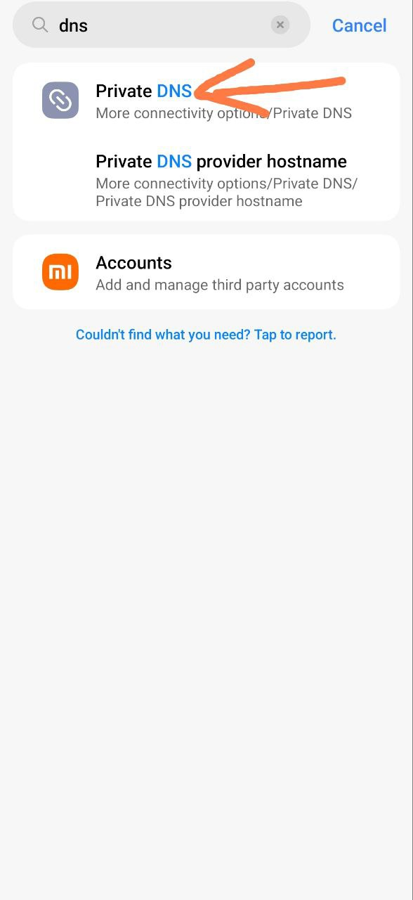

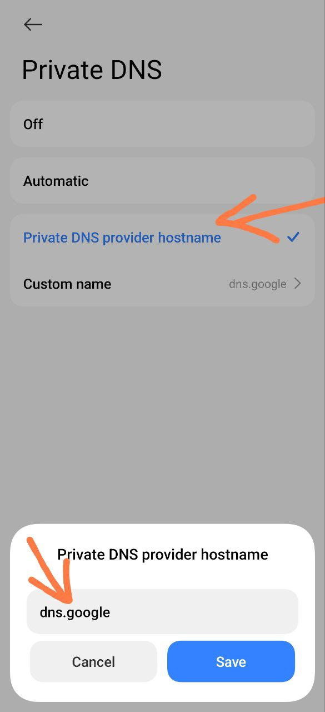

DNS over HTTPS services can be found [here](https://github.com/curl/curl/wiki/DNS-over-HTTPS) or [here](https://dnscrypt.info/public-servers/). However, be aware that DoH is not supported at the Android system level.

### <a id="setting">Adjusting the settings</a>

Proper settings are required for ByeByeDPI to work effectively:

- Allow notifications to be displayed.

  - 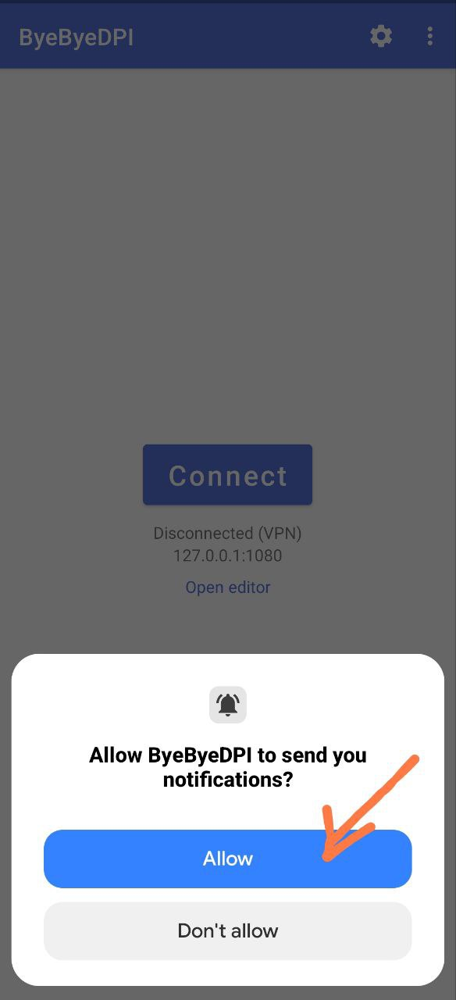

- Before clicking **Connect**, go to the **main settings** in ByeByeDPI (the gear icon in the top right).

  - 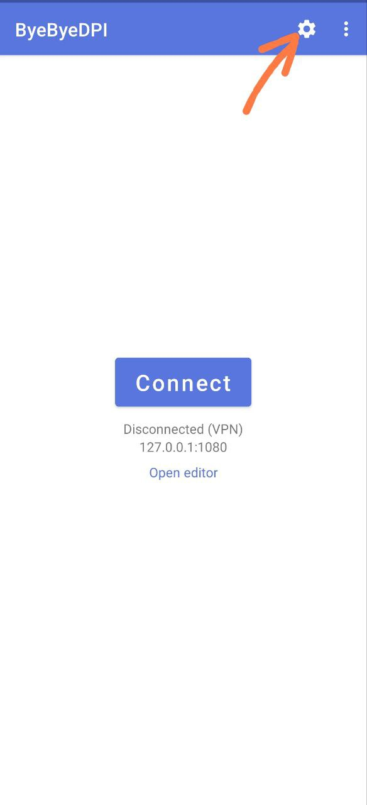

- Activate the ‘Use command line settings’ toggle.

  - 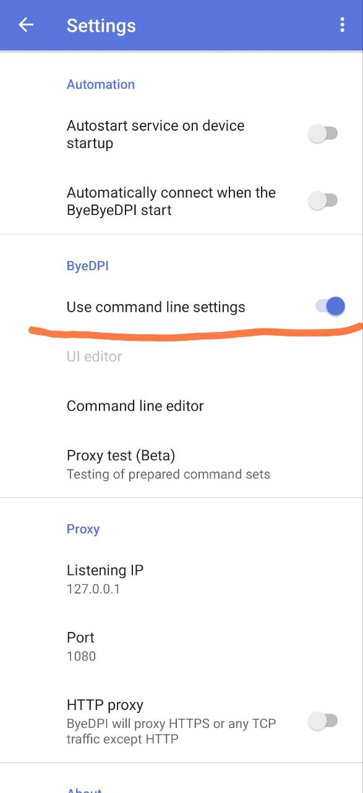

-  Go to **Proxy test (Beta)**[^1]

  - 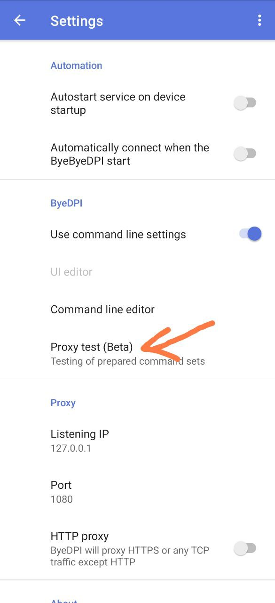

- Go to the **Selection Settings** (gear icon in the top right).

  - 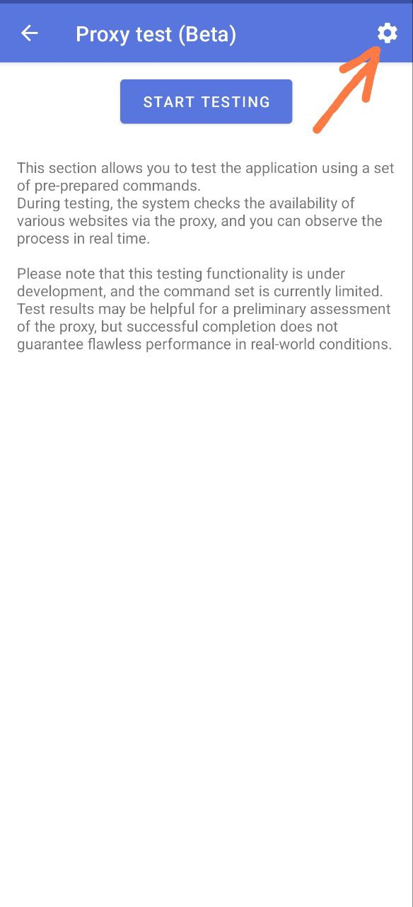

- Change **Number of queries to domain** to 5.

  - 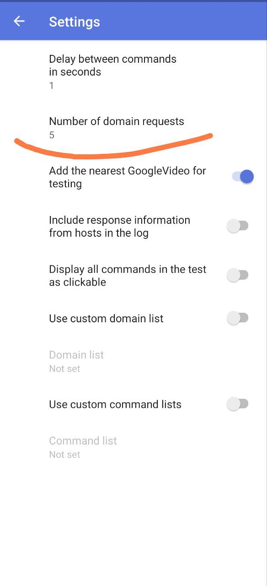

- Remove the ‘Add the nearest GoogleVideo for testing’ toggle.

  -  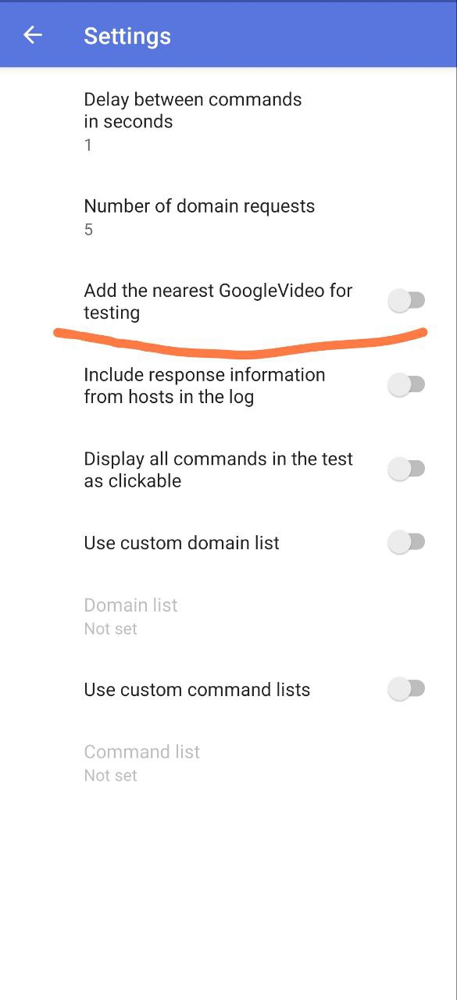

- Add a list of domains to be tested.

  - 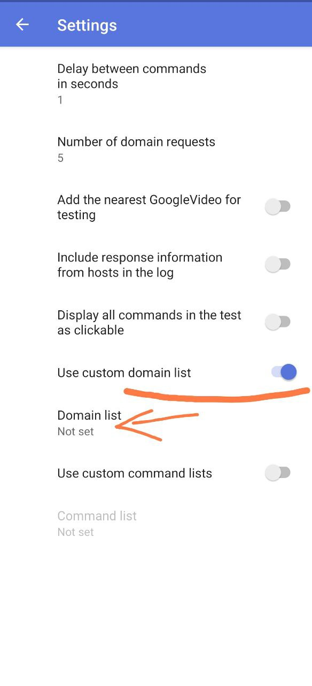

> [!WARNING]
> If you need to test a list of domains, write each domain on a new line. Do **NOT** separate the list with commas or other characters. Domains should be separated by **NEW LINES** only.

  - 

- Go back to **Proxy Test (Beta)** and click the ‘Start Testing’ button.

  - 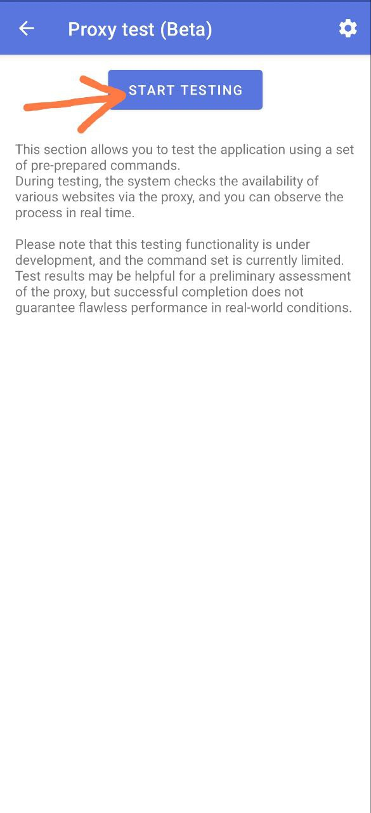

- Wait for the selection to complete. If successful, a list called ‘Commands with more than 50% success probability’[^2]. If the test fails, the solution can be found [here](problems.en.md#crash-proxy-test).

  - 

- Click on the strategy with the highest percentage (numbered 1), and select ‘Apply’ from the menu that appears.

  - 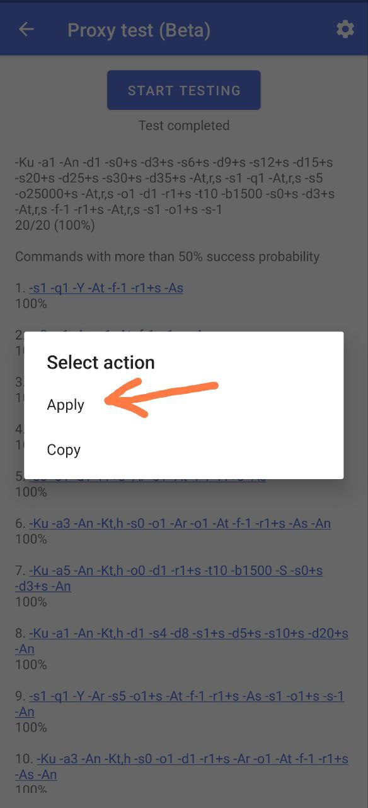

- Return to the main settings in ByeByeDPI.
- Under **Application Filter**, select **White List** mode([more about lists](features.en.md#whitelist-blacklist))

  - 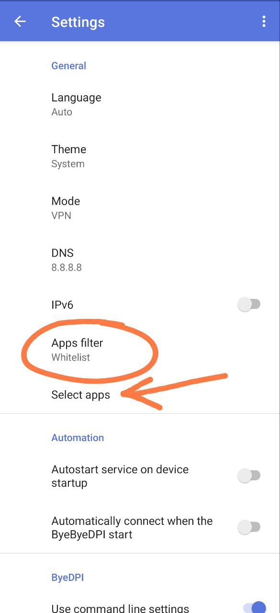

- Under **Select Applications**, check the boxes for the applications that should work via ByeByeDPI (those whose domains you tested in the Proxy Test).

  - 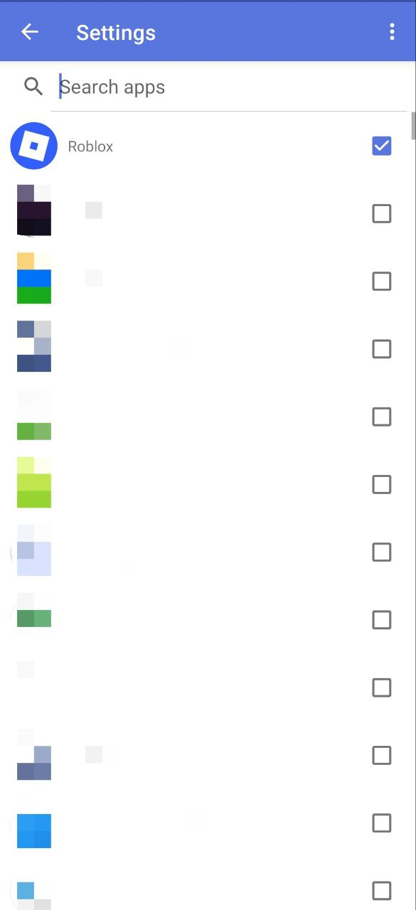

- Go to the main screen and press the **Connect** button.

  - 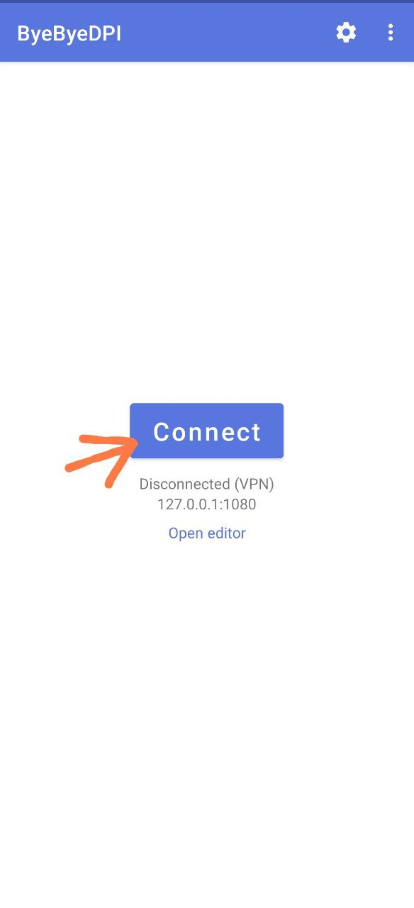

- After clicking **Connect**, give the application permission to connect.

  - 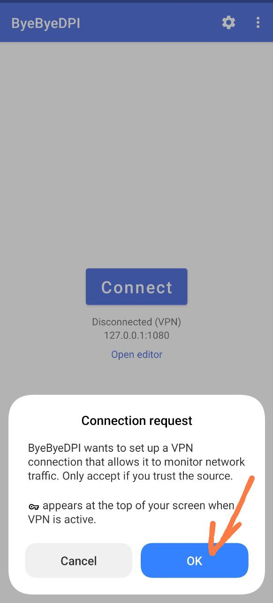

- Run the **required application** and check its functionality.
- ***If everything works well, the setup is complete.***

---

- If there are any issues with the operation of the desired application: go to **Proxy test (Beta)**
- It should store the result of the **previous test**.
- Click on strategy number 2 and select ‘Apply’ from the menu that appears.

  - 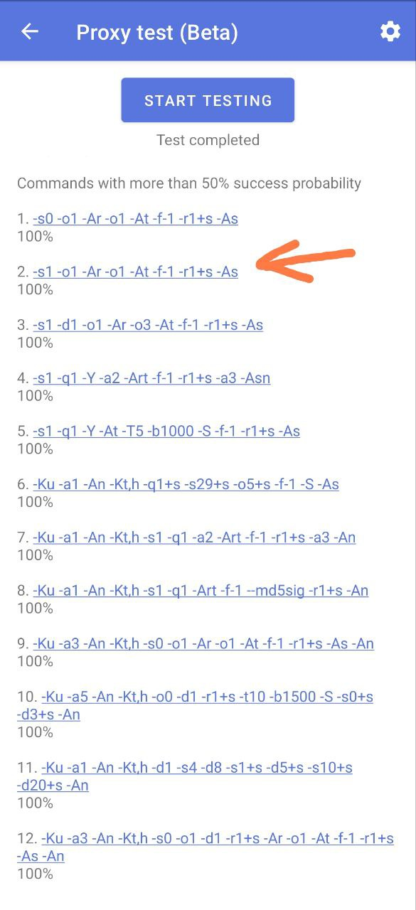

- Tap the **Connect** button again and test the application.
- Go through the strategies in order of increasing number (or decreasing percentages) until you’re satisfied with the application’s performance.

---

[^1]: Proxy Test is still in development. There may be errors. **Strategies are not generated automatically** — they are always the same. In the current implementation, the selection process does not actually choose anything. It merely checks the performance of a set of strategies that have been preconfigured by the developer.

[^2]: The percentages shown in the strategy test are not a direct indicator of performance; they reflect the number of successful responses from domains. You can enable their display in the test settings. Even if a strategy doesn’t show 100% success, it may still work (e.g., 30% success). Therefore, it's worth testing strategies one by one, starting from the highest percentage.
