## <a id="what-is-ByeByeDPI">Что такое ByeByeDPI?</a>

> _**[ByeByeDPI](https://github.com/romanvht/ByeDPIAndroid?tab=readme-ov-file)**_ или сокращённо **bbd** - приложение для **Android**, которое локально запускает _[ByeDPI](https://github.com/hufrea/byedpi)_ и перенаправляет весь трафик через него.

Для работы приложения требуется **Андроид 6** и более новые версии.
Приложение работает **только** на Android и Android TV, а также некоторых прошивках, основанных на Android.

**Не существует** версии для iOS, TizenOS, WebOS, Windows, MacOS, Linux, FreeBSD и т.д.
Если у вас система, не подходящая для установки ByeByeDPI, и вы по каким-то причинам не хотите использовать VPN или прокси - рассмотрите другие [варинты](others.md#other-options) (в этом разделе также есть варианты установки zapret в качестве модулей Magisk).

> [!IMPORTANT]
> Приложение **не является VPN** - обойти региональные блокировки (например, получить доступ к ChatGPT) при помощи ByeByeDPI **нельзя**!
> ByeByeDPI использует VPN-режим на Android для перенаправления трафика, но не передает информацию на удаленный сервер. Оно не шифрует трафик и не скрывает ваш IP-адрес.

_А если всё-таки очень хочется получить доступ к ИИ-сервисам и некоторым другим ресурсам без VPN - читайте про [специальный DNS](others.md#proxy-dns)._

Про механизмы блокировок более подробно можно узнать здесь:

- [Видео с канала Мой Компьютер](https://www.youtube.com/watch?v=vZhU7nrWRLc)
- [Интервью с ValdikSS](https://www.youtube.com/watch?v=bZxEU_kvP_I)
- [Сайт проекта Censorliber](https://zapret.vercel.app/about)
- [Официальная документация Zapret](https://github.com/bol-van/zapret)

## <a id="how-to-use-ByeByeDPI">Как пользоваться ByeByeDPI?</a>

Для начала, конечно, требуется скачать приложение. Приложение имеет стандартное расширение `apk`.

> [!WARNING]
> Приложение **полностью** бесплатно, автор не несёт ответственности, если вы переводите за приложение деньги третьим лицам. Разработчик также не несёт ответственности за версии, скачанные не из официального источника. 
> **Скачивать** приложение нужно **только** из официального репозитория:
> последняя на данный момент версия находится **[здесь](https://github.com/romanvht/ByeDPIAndroid/releases)**.

Так как механизм работы ByeByeDPI отличен от VPN, приложение **требует настройки**.

> [!IMPORTANT]
> Перед настройкой ByeByeDPI установите или обновите официальный клиент YouTube до последней версии.
> Не проверяйте работу ByeByeDPI на неофициальных клиентах т.к. это не может гарантировать правильность проверки, что повлечет проблемы с дальнейшей настройкой.

Проверять и настраивать неофициальные клиенты необходимо только после того, как вы убедитесь, что официальное приложение YouTube работает. Это справедливо и для других приложений: например, **YouTube Music**.

### <a id="setting">Настройка</a>

Для эффективной работы ByeByeDPI требуется правильная настройка:

- Разрешите показ уведомлений

  - 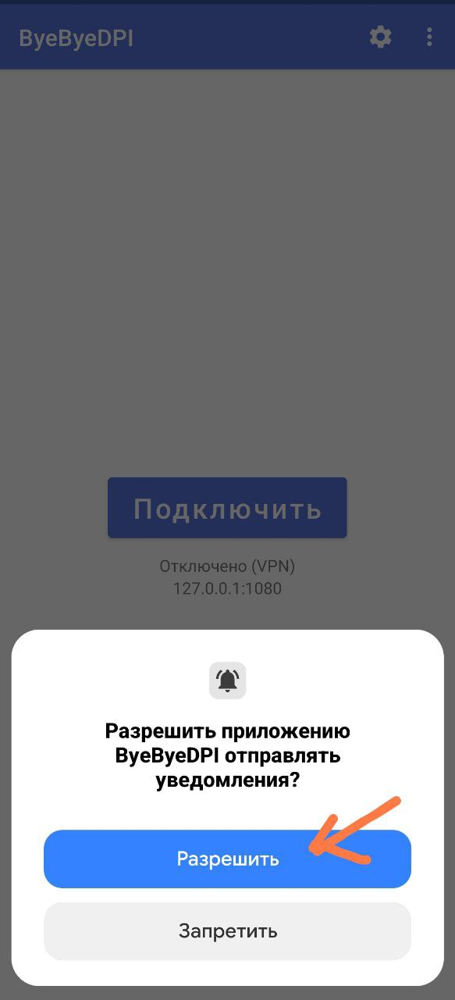

- Прежде чем нажать кнопку **Подключить**, зайдите в **_основные настройки ByeByeDPI_** (шестерёнка справа вверху):

  - 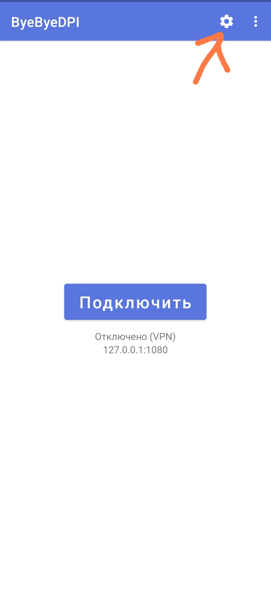

- Активируйте переключатель «Использовать командную строку»

  - 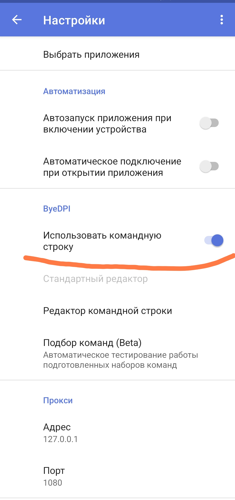

- Перейдите в пункт «Подбор команд (Beta)»[^1]

  - 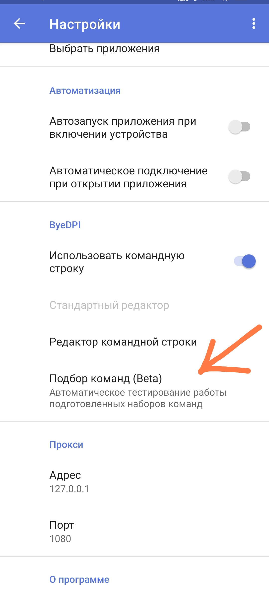

- Перейдите в **настройки Подбора** (шестерёнка справа сверху)

  - 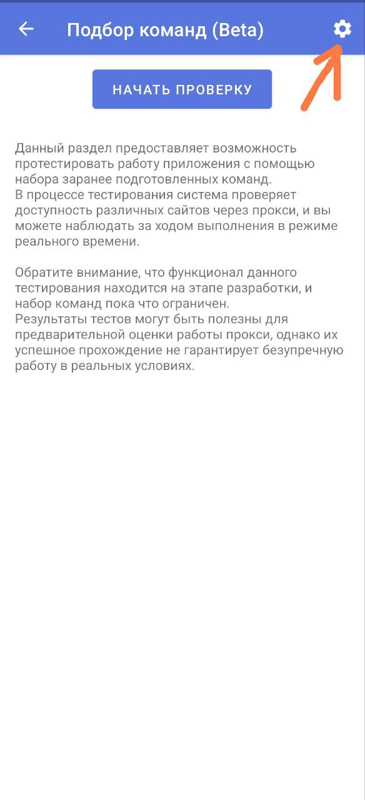

- Измените **Количество запросов к домену** на 5

  - 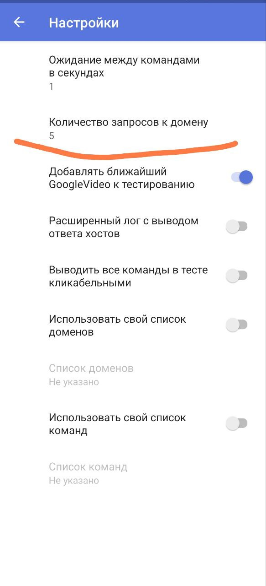

- Вернитесь в пункт **Подбор команд (Beta)** и нажмите на кнопку «Начать подбор»

  - 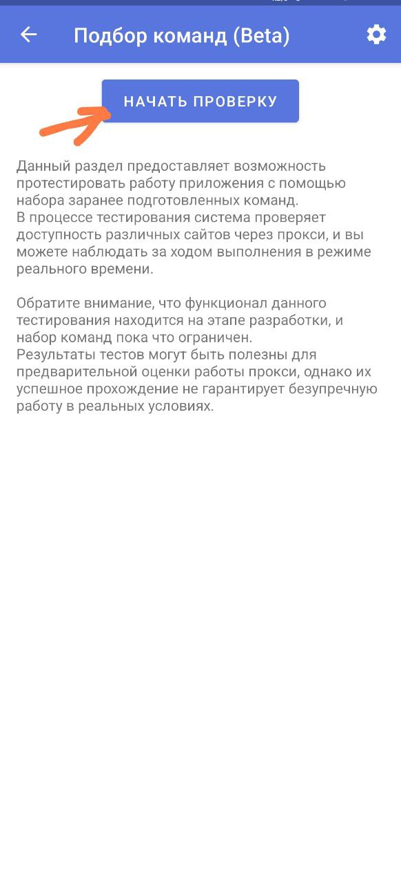

- Дождитесь окончания подбора. Об успешном окончании будет свидетельствовать список, который называется "Команды с успехом более 50%"[^2]. Вылетает подбор - решение [здесь](problems.md#crash-proxy-test).

  - 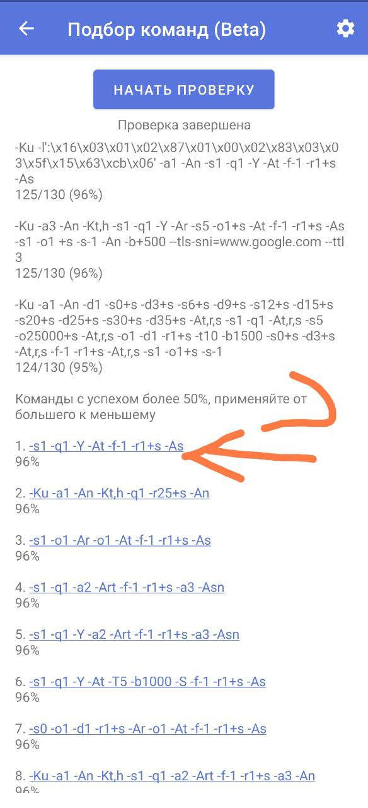

- Нажмите на команду (стратегию) с самым большим процентом (она имеет порядковый номер 1), и выберите «Применить» в появивщемся меню

  - 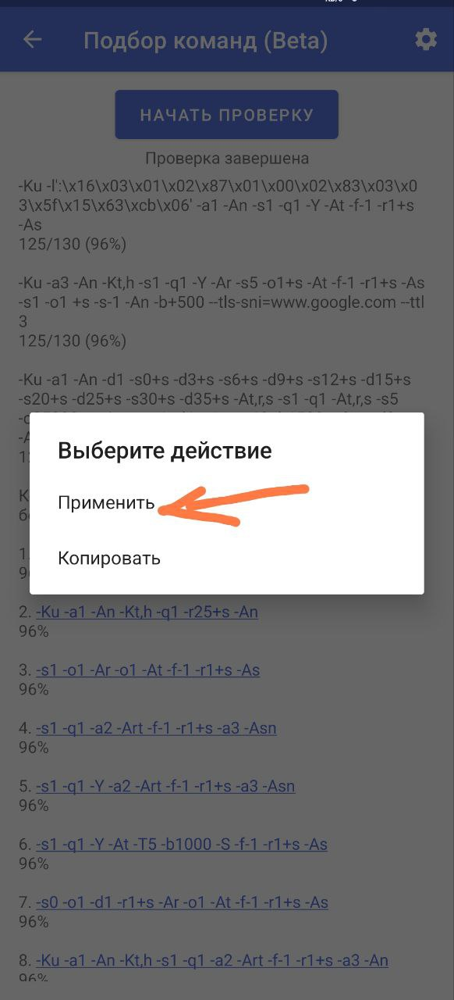

- Вернитесь в раздел основных настроек ByeByeDPI
- В пункте **Фильтр приложений** выберите режим **белого списка** ([подробнее про списки](features.md#whitelist-blacklist))

  - 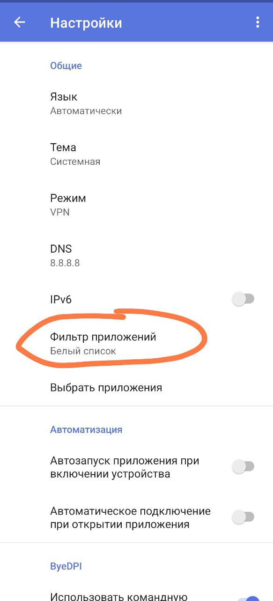

- В пункте **«Выбрать приложения»** отметьте **официальный клиент YouTube** и другие приложения, которые должны работать через ByeByeDPI

  - 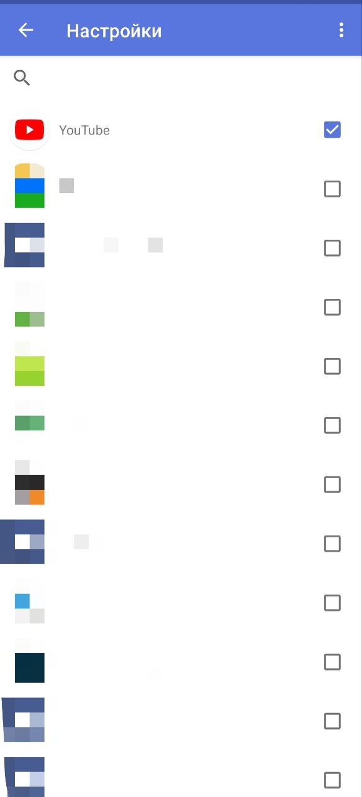

- Перейдите на основной экран и нажмите кнопку «Подключить»

  - 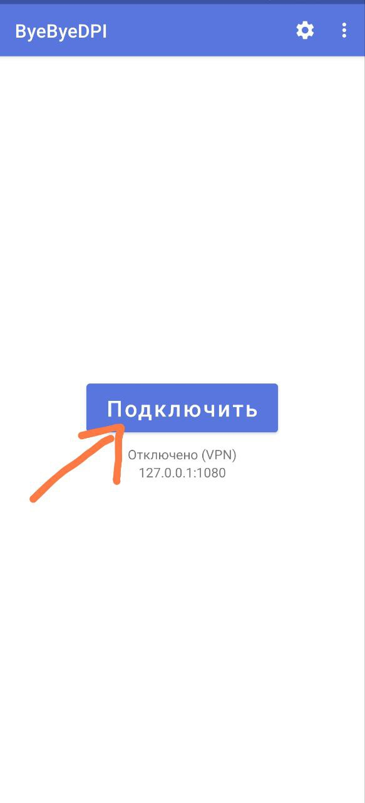

- После того как вы нажмёте кнопку **Подключить** необходимо дать приложению разрешение для подключения

  - 

- Запустите **официальный клиент YouTube** и проверьте как работает приложение
- **_Если всё хорошо работает - настройка завершена_**

---

- Если есть какие-то проблемы при воспроизведении: переходите в **«Подбор команд (Beta)»**
- Там должен сохраниться результат **предыдущего подбора**
- Нажмите на стратегию под номером 2 и выберите «Применить» в появившемся меню

  - 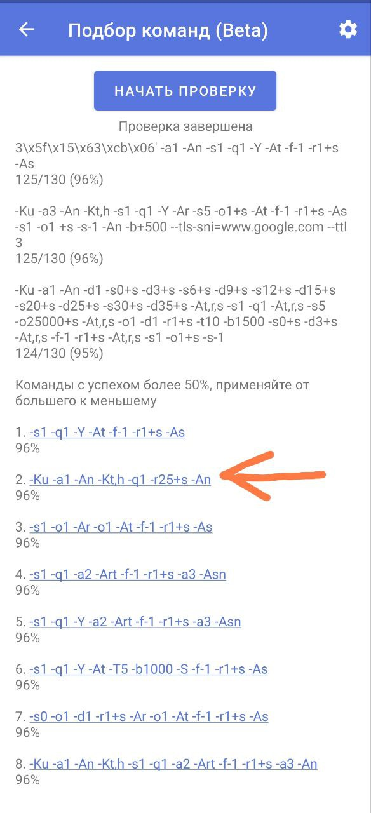

- Снова нажмите на кнопку «Подключить» на главном экране и проверьте работу YouTube.
- Перебирайте стратегии в порядке увеличения номера (уменьшения процентов) до тех пор, пока работа YouTube не будет вас устраивать.

---

[^1]: Подбор команд находится в разработке. Могут быть ошибки. **Стратегии не генерируются автоматический** - они всегда одни и те же. В текущей реализации подбор по сути ничего не подбирает - он просто проверяет работу набора стратегий, которые были добавлены в него разработчиком.

[^2]: Проценты в тесте стратегий не являются прямым показателем ее работоспособности, это количество успешных ответов от доменов. Вы можете включить их отображение в настройках теста. Может не сработать со 100%, но сработать с 30%. Поэтому стоит проверять по очереди, от наивысшего процента к низшему.
